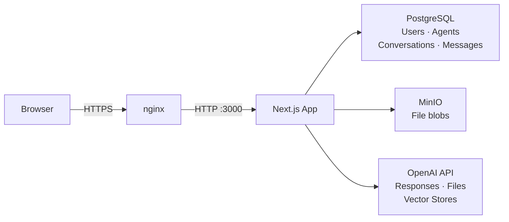

# Cranberry Juice

Multi-agent AI chatbot platform built with Next.js. Users can chat with a global assistant or create custom agents with their own system prompts, models, and knowledge bases (via file uploads + vector search).

## Features

- **Global chat** — default assistant at `/chat`
- **Custom agents** — per-agent system prompt, model, file search (RAG via OpenAI vector stores)
- **Streaming responses** — SSE via OpenAI Responses API
- **Deeper Research mode** — per-message model override to `gpt-5.4-mini`
- **Web search** — `web_search_preview` tool toggle
- **File attachments** — images and documents stored in MinIO, forwarded to OpenAI
- **Saved prompts** — per-agent reusable prompt library
- **Auth** — email/password with OTP email verification (Better Auth + Resend)
- **Bot protection** — Cloudflare Turnstile on auth forms

## Architecture

```
app/
  (auth)/           # Login, register, verify pages
  chat/             # Global chat (default agent)
  chat/[agentId]/   # Per-agent chat
  agents/           # Agent management
  api/
    chat/           # POST — SSE streaming chat endpoint
    agents/         # CRUD agents + file upload
    conversations/  # Delete conversation
    saved-prompts/  # CRUD saved prompts
    files/          # File proxy (presigned URLs)

components/
  chat/
    chat-room.tsx   # Streaming chat UI, message list
    chat-sidebar.tsx # Sidebar: search, conversation history, agents
    chat-input.tsx  # Textarea, mode toggles, saved prompts panel
  agents/
    agent-form.tsx  # Create/edit agent
    file-uploader.tsx

lib/
  auth.ts           # Better Auth server config
  openai.ts         # OpenAI client
  minio.ts          # MinIO S3 client
  prisma.ts         # Prisma client
  rate-limit.ts     # In-memory sliding window rate limiter
  agents/           # Agent queries, validation, vector store helpers
  chat/             # Chat queries, validation, saved prompts
```

**Stack:** Next.js 15 · TypeScript · Tailwind CSS · shadcn/ui · Prisma · PostgreSQL · MinIO · OpenAI Responses API · Better Auth · Resend · Cloudflare Turnstile

## Local Development

### Prerequisites

- Node.js 20+
- pnpm
- PostgreSQL
- MinIO (or any S3-compatible storage)
- OpenAI API key

### Setup

```bash
# Install dependencies
pnpm install

# Copy env file and fill in values
cp .env.example .env

# Run database migrations
pnpm prisma migrate dev

# Start dev server
pnpm dev
```

### Environment Variables

| Variable | Description |
|---|---|
| `DATABASE_URL` | PostgreSQL connection string |
| `BETTER_AUTH_SECRET` | Long random secret for session signing |
| `RESEND_API_KEY` | Resend API key for email |
| `RESEND_DOMAIN` | Verified domain in Resend |
| `NEXT_PUBLIC_TURNSTILE_SITE_KEY` | Cloudflare Turnstile site key |
| `TURNSTILE_SECRET_KEY` | Cloudflare Turnstile secret key |
| `OPENAI_API_KEY` | OpenAI API key |
| `MINIO_ENDPOINT` | MinIO endpoint URL |
| `MINIO_REGION` | MinIO region |
| `MINIO_ACCESS_KEY` | MinIO access key |
| `MINIO_SECRET_KEY` | MinIO secret key |
| `MINIO_BUCKET` | MinIO bucket name |
| `MINIO_FORCE_PATH_STYLE` | `true` for local MinIO |

### Commands

```bash
pnpm dev        # Start dev server
pnpm build      # Production build
pnpm start      # Start production server
pnpm typecheck  # TypeScript check
pnpm test       # Run tests
pnpm lint       # ESLint
pnpm format     # Prettier
```

## System Design Overview

### Requirements Coverage

| Requirement | Implementation |
|---|---|
| User registration & login | Better Auth v1.6.14 — email + password with OTP email verification via Resend |
| Account creation | `POST /api/auth/sign-up` — creates User + Session, sends OTP |
| Email/password auth | `POST /api/auth/sign-in/email` — bcrypt verify, HTTP-only session cookie |
| Bot protection | Cloudflare Turnstile on register + login forms, verified server-side |
| Store & associate prompts per agent | `SavedPrompt` table (FK → Agent + User); CRUD via `/api/saved-prompts` |
| Chat interface via OpenAI Responses API | `POST /api/chat` — streams SSE using `openai.responses.create({ stream: true })` |
| Upload files to project (OpenAI Files API) | `POST /api/agents/[id]/files` — uploads to OpenAI Files API + vector store for RAG |
| Scalability (multi-user, multi-project) | DB indexed on userId/agentId; stateless Next.js; rate limiting per user |
| Security (protect user data & auth flows) | Session-gated routes, ownership checks on all queries, HTTP-only cookies |
| Extensibility (future additions) | Model selection decoupled (`lib/agents/models.ts`); tools are additive array |
| Performance (low-latency responses) | SSE streaming — first token in <1s; `previous_response_id` avoids full history resend |
| Reliability (graceful error handling) | Error boundaries per route (`error.tsx`), SSE error events, toast notifications |

### Data Flow



### Key Design Decisions

**Authentication:** Better Auth handles sessions in PostgreSQL (not JWTs) — HTTP-only cookies prevent XSS token theft. Email OTP required before login is permitted.

**AI Context:** Uses OpenAI Responses API `previous_response_id` chaining — only the latest response ID is stored per conversation, not the full message history. This reduces token usage and latency on follow-up messages.

**File Storage (dual-path):** Every file is stored in both MinIO (permanent binary) and OpenAI Files API (inference). MinIO is the source of truth; OpenAI IDs are stored as references. Deletion hits both.

**Agent isolation:** Each agent has its own OpenAI vector store. RAG search is automatically scoped to that agent's knowledge base — no cross-contamination between agents.

**Streaming:** `/api/chat` returns a `text/event-stream` response. Events: `start` (IDs assigned) → `delta` (text chunks) → `done` (message persisted) → `error`. Client reads via `ReadableStream`.

**Rate limiting:** Sliding window, 20 req/min per user, in-memory (`lib/rate-limit.ts`). Swap to `@upstash/ratelimit` for Redis-backed multi-instance deployments.

### Production Deploy

```bash
# First deploy — run on server after docker compose up postgres minio
docker run --rm -e DATABASE_URL=... --network cranberry_cranberry \
  cranberry-juice:latest node_modules/.bin/prisma migrate deploy

# Subsequent deploys
./deploy.sh
```

Live demo: **https://cranberry.satu-meja.com**  
Architecture doc: [`docs/architecture-fsd.docx`](docs/architecture-fsd.docx)
